# Sistema de Monitoreo y Control de Temperatura y Humedad para el Instituto de Ensayo de Materiales de Ingeniería Civil de la Universidad Mayor de San Andrés
## Elección del Equipo

Para la implementación del servidor Web y WebSocket, se obtuvo la tablet - pc HP ElitePad 1000 G2, con un procesador Intel Atom de cuatro núcleos, 4 GB de memoria RAM y 128 GB de almacenamiento interno.


Las características del equipo son suficientes para el manejo de los servidores y de los servicios que manejará internamente.

## Elección e Instalación del Sistema Operativo

El sistema operativo elegido es el GNU/Linux Mint 21.1 Vera, el cual directamente nos provee con mucha facilidad de los paquetes necesarios para el proyecto.
Es recomendable tener conexión a internet en el proceso de instalación, para la descarga y actualización de paquetes en el mismo proceso de instalación.

1. Bienvenida de Instalación.
Para esta parte se selecciona el idioma de instalación y que posteriormente será el idioma del SO.

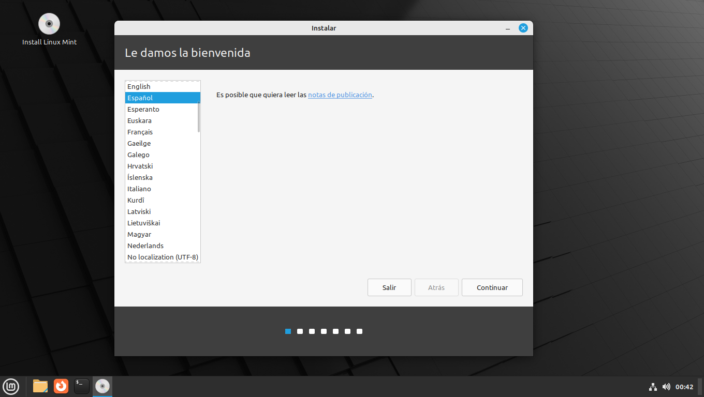

2. Elegir la distribución del teclado.
Esta opción va depende del teclado físico que se este utilizando, para este caso es un teclado con distribución de Español Latinoamericano.

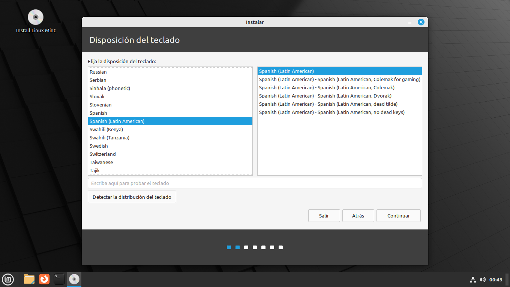

3. Códecs Multimedia.
Es recomendable seleccionar esta opción, ya que instala todos los códecs necesarios para la reproducción de audio y video para los distintos formatos existentes.

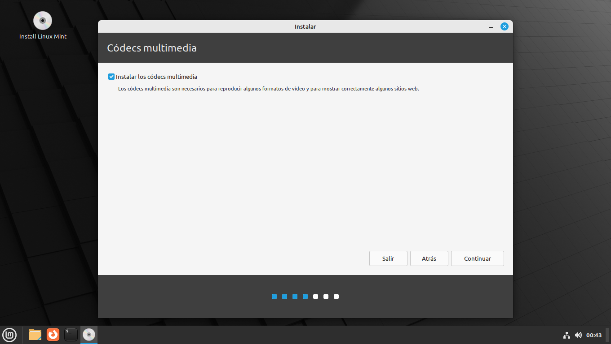

4. Tipo de Instalación.
En este caso se hará el particionado del disco de manera manual, el cual nos da la facilidad de agregar el tamaño tanto de la partición root, home (para el usuario) y la partición de intercambio. Entre otras posibilidades.

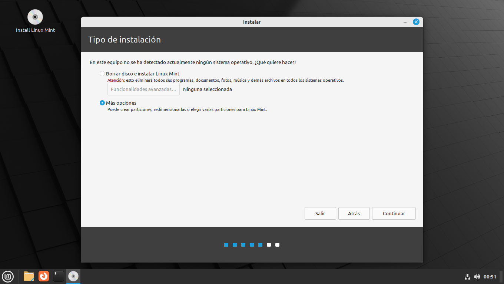

- Seleccionar: Nueva tabla de particioines... > Continuar

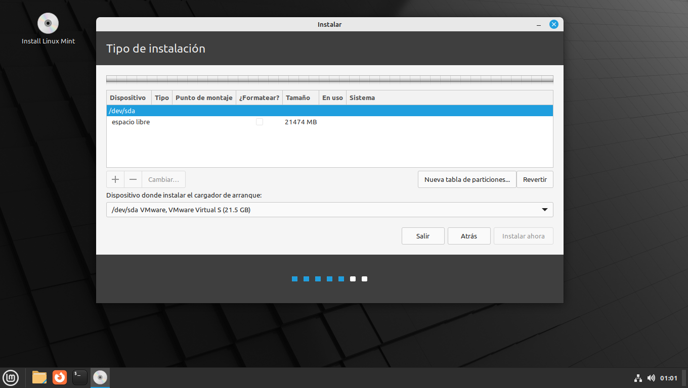

- Agregar una nueva partición (+). Definir para el sistema EFI 500MB, Primaria, Al principio de este espacio, <<Partición del Sistema EFI>>.

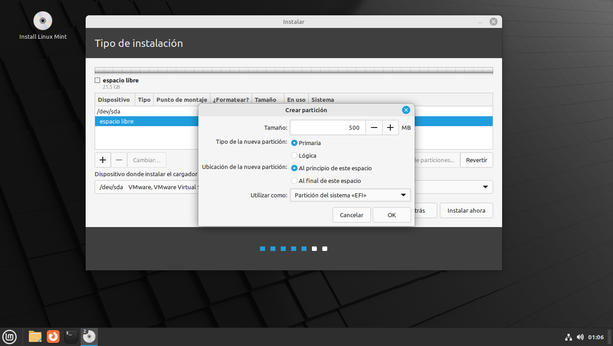

- Agregar una nueva partición de Intercambio de 4GB. Tamaño: 4096MB, Primaria, Al principio de este espacio, Utilizar como: área de intercambio.

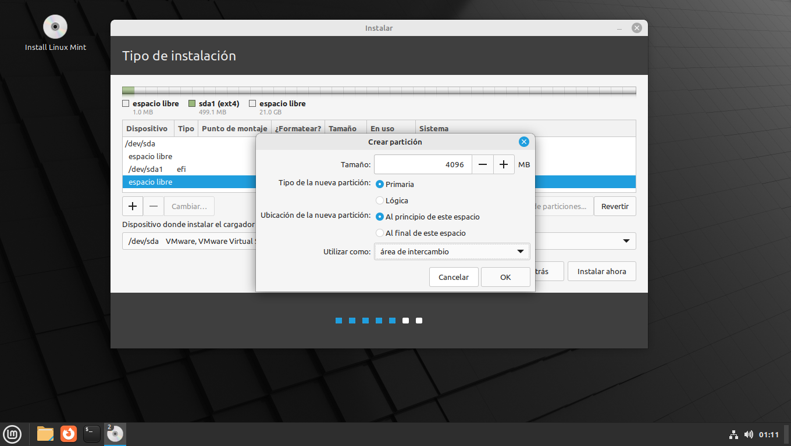

- Con el espacio libre restante agregar una nueva partición. Tamaño: 16879MB, Primaria, Al principio de este espacio, Utilizar como: sistema de ficheros ext4 transaccional, Punto de montaje: "/".

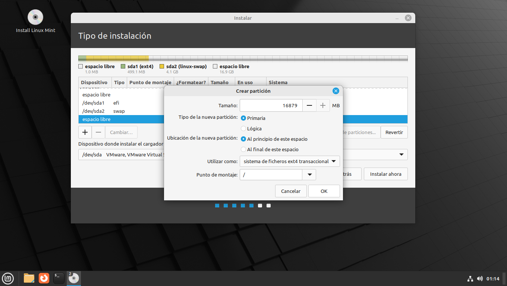

- Todas las particiones ya realizadas.

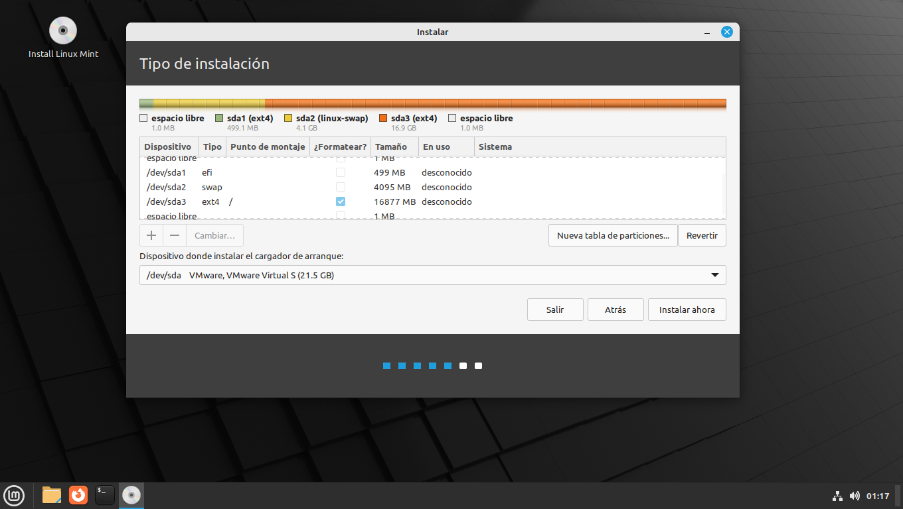

5. Definir la Región.

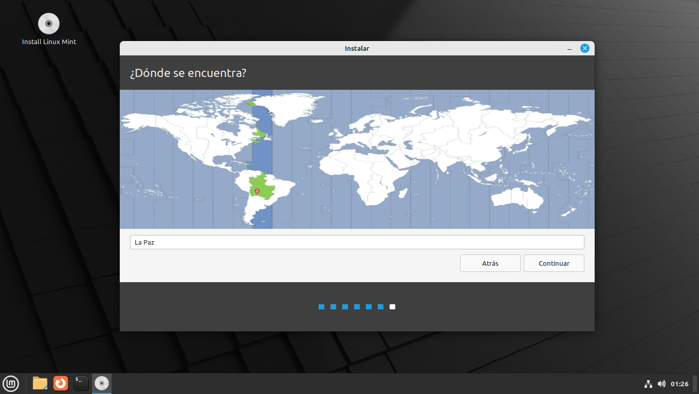

6. Nombre, Nombre de Usuario, Nombre del Equipo y Contraseña.
    - **Nombre:** Iem
    - **Nombre del Equipo:** iem-server
    - **Nombre de Usuario:** iem
    - **Contraseña:** iem2026
    - **Inicio de sesión automático**

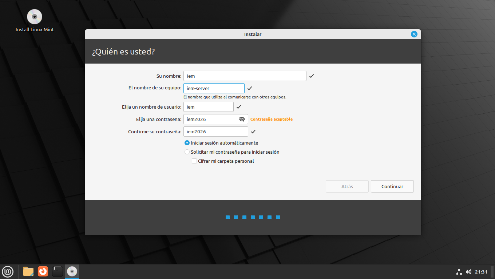
    
7. Proceso de Instalación.

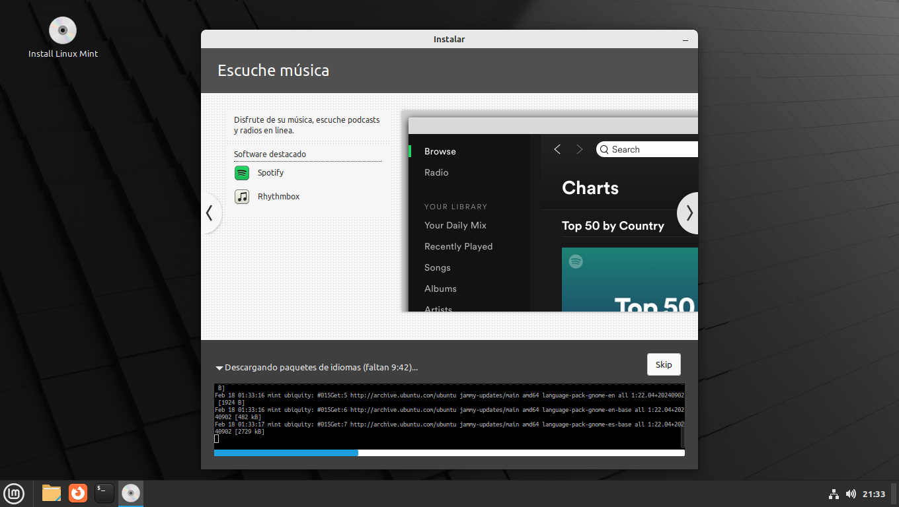

8. Instalación Finalizada y Reinicio.


## Instalación de LAMP (L por Linux, Apache, MariaDB (o también MySQL), PHP).
Abrir la terminal (Gnome Terminal), empezar la mayoría de los comandos con `sudo`, se muestra en los pasos depende lo que se require hacer.
1. Actualizar el repositorio de paquetes.
    ```bash
    sudo apt-get update
    ```
2. Actualizar los paquetes.
    ```bash
   sudo apt-get upgrade
    ```
3. Instalar Apache.
    ```bash
    sudo apt-get install apache2
    ```
4. Verificar que el servicio de apache este activo/corriendo.
    - Verificar el servicio.
        ```bash
        sudo systemctl status apache2
        ```
        * Si se muestra lo siguiente; entonces el servicio no esta corriendo.

        <pre>
        iem@iem-server:~$ $ sudo systemctl status apache2
        ○ apache2.service - The Apache HTTP Server
         Loaded: loaded (/lib/systemd/system/apache2.service; disabled; vendor preset: en>
         Active: inactive (dead) since Tue 2026-02-17 23:25:24 -04; 2s ago
           Docs: https://httpd.apache.org/docs/2.4/
        Process: 7010 ExecStop=/usr/sbin/apachectl graceful-stop (code=exited, status=0/S>
       Main PID: 6666 (code=exited, status=0/SUCCESS)
            CPU: 454ms
        </pre>

        * Activar el servicio y habilitar al momento de arrancar el sistema.
            ```bash
            sudo systemctl start apache2
            ```
            ```bash
            sudo systemctl enable apache2
            ```
        * Verificar nuevamente que el sistema este corriendo (con el primer comando).
        * Se debe obtener la siguiente salida.

        <pre>
        iem@iem-server:~$ $ sudo systemctl status apache2
        ● apache2.service - The Apache HTTP Server
         Loaded: loaded (/lib/systemd/system/apache2.service; enabled; vendor preset: ena>
         Active: active (running) since Tue 2026-02-17 23:31:09 -04; 28s ago
           Docs: https://httpd.apache.org/docs/2.4/
       Main PID: 7037 (apache2)
          Tasks: 55 (limit: 4184)
         Memory: 4.8M
            CPU: 106ms
         CGroup: /system.slice/apache2.service
                 ├─7037 /usr/sbin/apache2 -k start
                 ├─7038 /usr/sbin/apache2 -k start
                 └─7039 /usr/sbin/apache2 -k start
        </pre>

   - Como última verificación entrar en un navegador en el mismo equipo (o también desde otro, pero conectado a la misma red)
        * Verificar la dirección IP del servidor.
            ```bash
            ip a
            ```
        * Se obtiene la siguiente salida (para mi red en este caso).

            <pre>
            iem@iem-server:~$ ip a
            1: lo: <LOOPBACK,UP,LOWER_UP> mtu 65536 qdisc noqueue state UNKNOWN group default qlen 1000
                link/loopback 00:00:00:00:00:00 brd 00:00:00:00:00:00
                inet 127.0.0.1/8 scope host lo
                   valid_lft forever preferred_lft forever
                inet6 ::1/128 scope host
                   valid_lft forever preferred_lft forever
            2: ens33: <BROADCAST,MULTICAST,UP,LOWER_UP> mtu 1500 qdisc fq_codel state UP group default qlen 1000
                link/ether 00:0c:29:9a:da:1d brd ff:ff:ff:ff:ff:ff
                altname enp2s1
                inet 192.168.148.129/24 brd 192.168.148.255 scope global dynamic noprefixroute ens33
                   valid_lft 1393sec preferred_lft 1393sec
                inet6 fe80::87ba:6d31:aede:cefc/64 scope link noprefixroute
                   valid_lft forever preferred_lft forever
            </pre>

        * Por defecto se conoce que la dirección IP interno es: `127.0.0.1`
        * La dirección IP para la red local es: `192.168.148.129`\
    - En el navegador *web*, en la barra de direcciones introducir cualquiera de las direcciones IP obtenidas.
        [`http://127.0.0.1`](http://127.0.0.1)
        [`http://192.168.128.129`](http://192.168.148.129)
        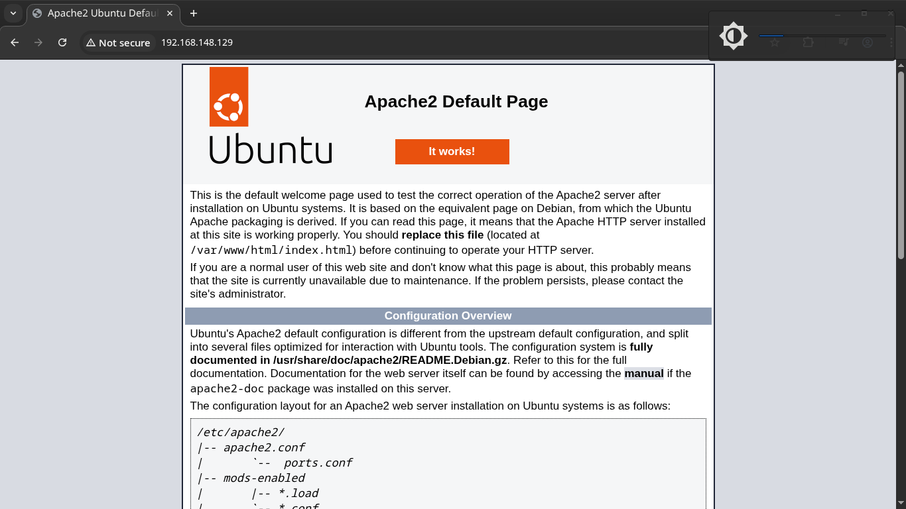
5. Instalación de la Base de Datos.
    - Instalación del paquete.
        ```bash
        sudo apt-get install mariadb-client mariadb-server
        ```
    - Verificar que el servicio de mariaDB este corriendo.
        ```bash
        sudo systemctl status mariadb
        ```
    - Si no se encuentra **activo** realizar los mismos pasos al de *apache* para su activación.
    - Iniciar la configuración de la Base de Datos (solo por única vez).
        ```bash
        sudo mysql_secure_installation
        ```
    - Realizar la configuración de la siguiente manera:

        <pre>
        ...
        Switch to unix_socket authentication [Y/n] n
        Change the root password? [Y/n] n
        Remove anonymous users? [Y/n] y
        Disallow root login remotely? [Y/n] n
        Remove test database and access to it? [Y/n] y
        Reload privilege tables now? [Y/n] y
        ...
        Thanks for using MariaDB!
        </pre>

    **NOTA:** La Base de Datos de MariaDB se preconfigurado por defecto con la autenticación de *unix_socket*, es decir, que solo se puede acceder a ella mediante `sudo mariabd` introduciendo así la contraseña de usuario del SO.
    - Ingresar a la base de datos de MariaDB.
        ```bash
        sudo mariadb
        ```
    - Dentro de MariaDB cambiar el tipo de autenticación.
        ```
        ALTER USER 'root'@'localhost' IDENTIFIED VIA mysql_native_password USING PASSWORD('iem-umsa-2026');
        ```
    - Actualizar privilegios.
        ```
        FLUSH PRIVILEGES;
        ```
    - Salir de MariaDB.
        ```
        exit;
        ```
    - Volver a ingresar, pero con usuario y contraseña definidos.
        ```bash
        mariadb -u root -p
        ```
6. Instalación de PHP.


